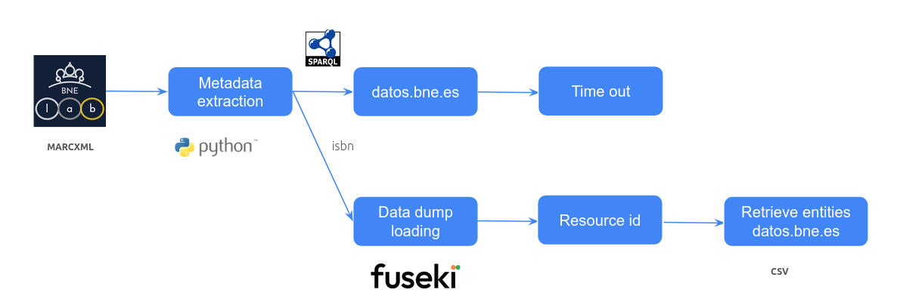

# bne-marc2lod

This project tends to align marc records made available by the National Library of Spain and the Linked Open Data version made available at datos.bne.es. 

This repository is based on the dataset https://datosabiertos.bne.es/catalogo/dataset/catalogo-bibliografico-monografias-modernas1

## Workflow

1. Download the dataset in MARC-XML: https://datosabiertos.bne.es/catalogo/dataset/catalogo-bibliografico-monografias-modernas1 
2. Extract metadata: large dataset, so we retrieve some fields (e.g., author, title, isbn)
3. Query datos.bne.es: when you run many queries, the repository stops working
4. Load dump dataset in local: using Fuseki, problem only Resources available, not the whole set of classes (e.g., Work, Expression, Author)
6. Match records by isbn and get Resource id
7. With the Resource id, and one by one, retrieve the RDF from datos.bne.es and get the ids for authors and the rest of entities



## Scripts

It reads the marcxml file and creates a csv file: [Marc2CSVparser-bne.py](Marc2CSVparser-bne.py)

Then, for each record, it tries to recover URIs from datos.bne.es: [process-bne.py](process-bne.py) reads the csv file and queries datos.bne.es using the script [sparqBne.py](sparqlBne.py)

## Fuseki
[Fuseki](https://jena.apache.org/documentation/fuseki2/) was employed as RDF data storage system. The following commands were used to load and run the SPARQL server. Note that the data provided needed some adjustments (e.g., incorrect URLS and malformed values) in order to be loaded in Fuseki.

- Checking data: ./riot --validate ~/bne/clean.nt
- Loading data dump: ./tdb2.xloader --loc=DB2 ~/bne/clean.nt
- Running ./fuseki-server --tdb2 --loc=/home/apache-jena-6.1.0/bin/DB /dataset
- SPARQL access: http://localhost:3030/dataset/sparql

## Alignment

To the best of our knowledge, there is no direct connection from marc to LOD. As a result, we studied an alternative approach using the fields title, author and isbn. See, for example:

```
PREFIX rdf: <http://www.w3.org/1999/02/22-rdf-syntax-ns#>
PREFIX rdfs: <http://www.w3.org/2000/01/rdf-schema#>
PREFIX bne: <https://datos.bne.es/def/>

SELECT *
WHERE {
  ?work rdf:type bne:C1001.
  ?work  rdfs:label "50 a\u00F1os de memoria" .
  ?work bne:id ?id.
  ?work bne:OP1002 ?exp.
  ?exp bne:OP2001 ?recurso.
  ?recurso bne:P3013 "978-84-690-4694-4".
  OPTIONAL {?work owl:sameAs ?sameAsWork.}
  OPTIONAL {?work bne:OP1001 ?author . ?author rdfs:label "Bas Carbonell, Manuel" . ?author owl:sameAs ?sameAsAuthor .}
  OPTIONAL {?work bne:OP7001 ?subject . ?subject rdfs:label ?subjectName}
 }
LIMIT 100
```

## References
- Candela, G. (2026). Towards a semantic approach in GLAM Labs: The case of the Data Foundry at the National Library of Scotland. Journal of Information Science, 52(1), 3–21. https://doi.org/10.1177/01655515231174386
- Candela, G., Chambers, S., Irollo, A., Freire, N., Dritsou, V., Isaac, A., Benardou, A., Garnett, V., & Tasovac, T. (n.d.). A Workflow to publish Collections as Data: looking back at Europeana.eu and forward to the common European data space for cultural heritage (Version 1, Vol. 965). Transformations: A DARIAH Journal . https://doi.org/10.46298/transformations.14774
- Candela, G., Rosiński, C., & Margraf, A. (2025). A reproducible framework to publish and reuse Collections as data: the case of the European Literary Bibliography (Version 4, Vol. 965, Issue 170). Transformations: A DARIAH Journal . https://doi.org/10.46298/transformations.14729
